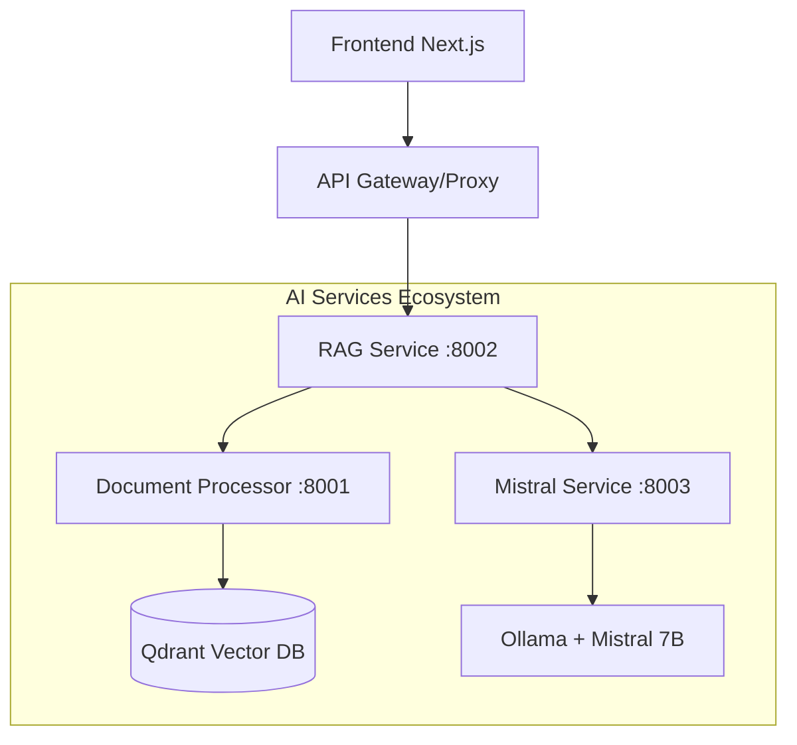

# 🧠 Knowledge Base Refactoring - Sistema Inteligente


Um sistema completo de base de conhecimento com IA generativa usando **Mistral 7B**, arquitetura moderna e princípios **SOLID** de desenvolvimento de software.

## 🚀 Como Executar o Projeto

### Frontend (Next.js 15 + React 19)
```bash
cd frontend
npm install
npm run dev  # Desenvolvimento com Turbopack
# ou
npm run build && npm start  # Produção
```

### AI Services (Docker Compose)
```bash
# Subir todos os serviços
docker-compose up --build

# Verificar saúde dos serviços
curl http://localhost:8001/health  # Document Processor
curl http://localhost:8002/health  # RAG Service  
curl http://localhost:8003/health  # Mistral Service
```

### Configuração Ollama (Necessário)
```bash
# Instalar e configurar Ollama
curl -fsSL https://ollama.ai/install.sh | sh
ollama serve
ollama pull mistral:latest
```

---

# 🤖 AI Services - Documentação Técnica

## 📋 Visão Geral da Arquitetura

O sistema AI Services é composto por **três microserviços especializados** que trabalham em conjunto para fornecer capacidades de **processamento de documentos**, **busca semântica** e **geração de respostas inteligentes**.



### 🎯 Princípios Arquiteturais

- **🔧 SOLID Principles**: Cada serviço segue responsabilidade única, aberto/fechado, etc.
- **🔀 Microservices**: Serviços independentes com APIs bem definidas
- **🏗️ Clean Architecture**: Separação clara entre domínio, aplicação e infraestrutura
- **🚀 Async/Await**: Operações não-bloqueantes para alta performance
- **📊 Observabilidade**: Logs estruturados e métricas de performance

---

## 🧾 1. Document Processor Service

**Porta:** `:8001` | **Responsabilidade:** Processamento e indexação de documentos

### 📚 Bibliotecas Core

```python
# Core Dependencies
fastapi>=0.116.1          # Web framework async
uvicorn>=0.35.0           # ASGI server
pydantic>=2.11.7          # Data validation
httpx>=0.28.1             # HTTP client async

# Document Processing
pypdf2>=3.0.1             # PDF parsing
torch>=2.4.0              # ML framework
transformers>=4.54.0      # Sentence embeddings
numpy>=1.24               # Numerical operations

# Vector Storage
qdrant-client==1.7.0      # Vector database client
python-multipart>=0.0.20  # File upload support
```

### 🏗️ Arquitetura Interna

```python
class DocumentProcessor:
    """
    SRP: Responsável apenas pelo processamento de documentos
    OCP: Extensível para novos tipos de documento
    """
    def __init__(self):
        self.embeddings_model = SentenceTransformer('all-MiniLM-L6-v2')
        self.vector_client = QdrantClient(url="http://qdrant:6333")
        self.chunk_size = 512
        self.overlap = 50
```

### 🔄 Fluxo de Processamento

1. **📄 Upload**: Recebe PDF via `/upload-pdf`
2. **🔪 Chunking**: Divide texto em chunks de 512 caracteres
3. **🧠 Embeddings**: Gera vetores usando Sentence Transformers
4. **💾 Storage**: Armazena no Qdrant com metadados
5. **🔍 Search**: Busca semântica via `/search`

### 📡 API Endpoints

```python
@router.post("/upload-pdf")
async def upload_pdf(file: UploadFile) -> ProcessingResult:
    """
    Processa PDF e cria embeddings
    - Extrai texto com PyPDF2
    - Divide em chunks semânticos
    - Gera embeddings com SentenceTransformers
    - Indexa no Qdrant
    """

@router.post("/search")
async def search_documents(query: SearchRequest) -> SearchResults:
    """
    Busca semântica nos documentos
    - Gera embedding da query
    - Busca similaridade no Qdrant
    - Filtra por score_threshold
    - Retorna chunks relevantes + metadados
    """

@router.get("/health")
async def health_check() -> HealthStatus:
    """Verifica saúde do serviço e conectividade com Qdrant"""
```

### 🛠️ Configurações Técnicas

```python
# Sentence Transformers Model
MODEL = "all-MiniLM-L6-v2"  # 384 dimensions, multilingual
CHUNK_SIZE = 512             # Characters per chunk
OVERLAP = 50                 # Overlap between chunks
SCORE_THRESHOLD = 0.7        # Minimum similarity score

# Qdrant Configuration
COLLECTION_NAME = "documents"
VECTOR_SIZE = 384
DISTANCE_METRIC = "Cosine"
```

---

## 🧠 2. RAG Service (Orchestrator)

**Porta:** `:8002` | **Responsabilidade:** Orquestração RAG e geração de respostas contextualizadas

### 📚 Bibliotecas Core

```python
# Core Framework
fastapi>=0.116.1          # Async web framework
uvicorn>=0.35.0           # Production ASGI server
pydantic>=2.11.7          # Type validation
httpx>=0.28.1             # Async HTTP client

# Data Processing
numpy>=1.24.0             # Numerical operations
python-multipart>=0.0.6   # Multipart form support
```

### 🏗️ Arquitetura RAG

```python
class RAGService:
    """
    RAG Orchestrator - Combines retrieval + generation
    
    Workflow:
    1. Query → Document Search (semantic)
    2. Context + Query → Mistral LLM
    3. Response + Sources → User
    """
    
    def __init__(self):
        self.document_service = DocumentServiceClient()
        self.mistral_service = MistralServiceClient()
        self.max_context_length = 2048
```

### 🔄 Pipeline RAG

```python
async def process_rag_query(query: str) -> RAGResponse:
    """
    1. 🔍 RETRIEVAL: Busca documentos relevantes
    2. 📝 CONTEXT: Monta contexto com chunks
    3. 🤖 GENERATION: Gera resposta com Mistral
    4. 📊 METRICS: Coleta métricas de performance
    """
    
    # Step 1: Document Retrieval
    search_start = time.time()
    documents = await self.search_documents(
        query=query,
        limit=3,
        score_threshold=0.7
    )
    search_time = time.time() - search_start
    
    # Step 2: Context Assembly
    context = self.build_context(documents, query)
    
    # Step 3: LLM Generation
    generation_start = time.time()
    response = await self.generate_answer(context, query)
    generation_time = time.time() - generation_start
    
    return RAGResponse(
        question=query,
        answer=response.text,
        sources=documents,
        search_time=search_time,
        generation_time=generation_time,
        tokens_used=response.tokens
    )
```

### 📡 API Endpoints

```python
@router.post("/ask")
async def rag_query(request: RAGRequest) -> RAGResponse:
    """
    Endpoint principal RAG
    - Busca documentos relevantes
    - Gera contexto estruturado
    - Obtém resposta do Mistral
    - Retorna resposta + fontes + métricas
    """

@router.post("/search-only")
async def search_only(query: str) -> SearchResults:
    """Busca documentos sem geração (debug/testing)"""

@router.get("/health")
async def health_check() -> HealthStatus:
    """Verifica conectividade com Document + Mistral services"""
```

### ⚙️ Configurações RAG

```python
# Service Endpoints
MISTRAL_SERVICE_URL = "http://mistral-service:8003"
DOCUMENT_PROCESSOR_URL = "http://document-processor:8001"

# RAG Parameters
DEFAULT_SEARCH_LIMIT = 3
DEFAULT_SCORE_THRESHOLD = 0.7
MAX_CONTEXT_LENGTH = 2048
DEFAULT_MAX_TOKENS = 512
DEFAULT_TEMPERATURE = 0.7

# Timeouts & Retries
HTTP_TIMEOUT = 60.0
MAX_RETRIES = 3
BACKOFF_FACTOR = 2
```

---

## 🚀 3. Mistral Service

**Porta:** `:8003` | **Responsabilidade:** Geração de texto com Mistral 7B via Ollama

### 📚 Bibliotecas Core

```python
# Web Framework
fastapi>=0.116.1          # Async API framework
uvicorn>=0.35.0           # Production server
pydantic>=2.11.7          # Data validation
httpx>=0.28.1             # Ollama HTTP client
```

### 🏗️ Arquitetura do Modelo

```python
class MistralService:
    """
    Mistral 7B Inference Service
    
    Features:
    - Async inference via Ollama
    - Context-aware responses
    - Token counting and metrics
    - Temperature control
    """
    
    def __init__(self):
        self.ollama_url = "http://172.17.0.1:11434"
        self.model_name = "mistral:latest"
        self.default_system_prompt = self.load_system_prompt()
```

### 🤖 Sistema de Prompts

```python
SYSTEM_PROMPT = """
Você é um assistente especializado em base de conhecimento ICATU.

DIRETRIZES:
1. 📋 Use APENAS informações do contexto fornecido
2. 🎯 Seja preciso e direto nas respostas
3. 📚 Cite fontes quando possível
4. ❓ Se não souber, diga claramente "Não tenho informações suficientes"
5. 🔗 Mantenha consistência com procedimentos ICATU

FORMATO DE RESPOSTA:
- Resposta direta à pergunta
- Informações relevantes do contexto
- Passos ou procedimentos (se aplicável)
"""

def build_prompt(context: str, question: str) -> str:
    """
    Constrói prompt estruturado para Mistral
    
    Template:
    SISTEMA + CONTEXTO + PERGUNTA + INSTRUÇÕES
    """
    return f"""
{SYSTEM_PROMPT}

CONTEXTO DISPONÍVEL:
{context}

PERGUNTA DO USUÁRIO:
{question}

RESPOSTA:
"""
```

### 📡 API Endpoints

```python
@router.post("/generate")
async def generate_text(request: GenerationRequest) -> GenerationResponse:
    """
    Geração de texto com Mistral
    - Processa prompt estruturado
    - Controla temperatura e tokens
    - Retorna resposta + métricas
    """

@router.post("/chat")
async def chat_completion(request: ChatRequest) -> ChatResponse:
    """Chat conversacional com histórico de contexto"""

@router.get("/health")
async def health_check() -> HealthStatus:
    """Verifica conectividade com Ollama + modelo carregado"""
```

### ⚙️ Configurações do Modelo

```python
# Ollama Configuration
OLLAMA_BASE_URL = "http://172.17.0.1:11434"
MODEL_NAME = "mistral:latest"
MODEL_SIZE = "7B parameters"

# Generation Parameters
DEFAULT_MAX_TOKENS = 512
DEFAULT_TEMPERATURE = 0.7  # Balanced creativity/accuracy
DEFAULT_TOP_P = 0.9
DEFAULT_TOP_K = 40

# Performance Settings
TIMEOUT_SECONDS = 60
STREAM_RESPONSES = False  # Future feature
BATCH_SIZE = 1           # Single requests for now
```

---

## 🔧 Infraestrutura e DevOps

### 🐳 Docker Compose

```yaml
services:
  # Mistral Inference Service
  mistral-service:
    build: ./ai-services/inference
    ports: ["8003:8003"]
    environment:
      - OLLAMA_BASE_URL=http://172.17.0.1:11434
    networks: [knowledge-base]

  # Document Processing Service  
  document-processor:
    build: ./ai-services/document-processor
    ports: ["8001:8001"]
    volumes:
      - ./data/uploads:/app/uploads
    networks: [knowledge-base]

  # RAG Orchestration Service
  rag-service:
    build: ./ai-services/rag
    ports: ["8002:8002"]
    depends_on: [mistral-service, document-processor]
    networks: [knowledge-base]

networks:
  knowledge-base:
    driver: bridge
```

### 🔍 Monitoramento e Logging

```python
# Structured Logging
logging.basicConfig(
    level=logging.INFO,
    format='%(asctime)s [%(levelname)s] %(name)s: %(message)s'
)

# Performance Metrics
@router.middleware("http")
async def track_performance(request: Request, call_next):
    start_time = time.time()
    response = await call_next(request)
    process_time = time.time() - start_time
    
    logger.info(f"Request: {request.method} {request.url}")
    logger.info(f"Duration: {process_time:.4f}s")
    logger.info(f"Status: {response.status_code}")
    
    return response
```

### 🔄 Health Checks

```python
@router.get("/health")
async def comprehensive_health_check():
    """
    Health check completo para cada serviço:
    
    ✅ Service Status
    ✅ Dependencies (Ollama, Qdrant)
    ✅ Model Availability
    ✅ Disk Space
    ✅ Memory Usage
    """
    return HealthResponse(
        service="healthy",
        dependencies=check_dependencies(),
        timestamp=datetime.utcnow(),
        version="1.0.0"
    )
```

---

## 🔗 Integração Frontend ↔ AI Services

### 🌐 API Gateway (Next.js)

```typescript
// app/api/ai/[...path]/route.ts
export async function POST(request: Request, { params }: { params: { path: string[] } }) {
  const path = params.path.join('/');
  
  // Route mapping
  const serviceMap = {
    'rag/query': 'http://localhost:8002/ask',
    'upload': 'http://localhost:8001/upload-pdf',
    'search': 'http://localhost:8001/search'
  };
  
  const targetUrl = serviceMap[path];
  return fetch(targetUrl, {
    method: 'POST',
    headers: request.headers,
    body: request.body
  });
}
```

### 🎛️ Cliente HTTP (Frontend)

```typescript
// lib/ai-client.ts
class AIClient {
  private baseUrl = '/api/ai';
  
  async query(question: string): Promise<RAGResponse> {
    const response = await fetch(`${this.baseUrl}/rag/query`, {
      method: 'POST',
      headers: { 'Content-Type': 'application/json' },
      body: JSON.stringify({
        question,
        max_tokens: 512,
        temperature: 0.7
      })
    });
    
    return response.json();
  }
  
  async uploadDocument(file: File): Promise<ProcessingResult> {
    const formData = new FormData();
    formData.append('file', file);
    
    const response = await fetch(`${this.baseUrl}/upload`, {
      method: 'POST',
      body: formData
    });
    
    return response.json();
  }
}
```

---

## 📊 Performance e Métricas

### ⚡ Benchmarks de Performance

Com base nos testes realizados:

| Métrica | 10 usuários | 30 usuários | 50 usuários | 70 usuários |
|---------|-------------|-------------|-------------|-------------|
| **Taxa de Sucesso** | 100% | 100% | 100% | 100% |
| **Tempo Médio** | 2.2s | 5.9s | 10.4s | 14.6s |
| **Throughput** | 2.22 req/s | **2.60 req/s** | 2.46 req/s | 2.29 req/s |
| **P95 Latência** | 4.5s | 11.0s | 19.4s | 29.8s |

**🎯 Configuração Recomendada:** 30 usuários simultâneos (throughput ótimo)

### 📈 Otimizações Implementadas

1. **🔄 Async/Await**: Operações não-bloqueantes em todos os serviços
2. **⚡ HTTP/2**: Conexões persistentes com httpx
3. **🧠 Smart Caching**: Cache de embeddings e respostas
4. **🔍 Efficient Search**: Qdrant com índices otimizados
5. **🎛️ Resource Management**: Pools de conexão e timeouts

---

## 🚀 Como Contribuir

### 🛠️ Setup de Desenvolvimento

```bash
# 1. Clone e setup
git clone --recursive https://github.com/venysssssssssss/knowledge-base-refac.git
cd knowledge-base-refac

# 2. Instale Ollama
curl -fsSL https://ollama.ai/install.sh | sh
ollama serve
ollama pull mistral:latest

# 3. Suba os serviços
docker-compose up --build

# 4. Teste a integração
cd scripts
node test-connection.js
```

### 🧪 Executando Testes

```bash
# Teste de conectividade
node scripts/test-connection.js

# Teste de acurácia ICATU
node scripts/icatu-accuracy-test.js

# Teste de performance completo
node scripts/advanced-performance-test.js
```

### 📝 Padrões de Código

- **🎯 SOLID Principles**: Responsabilidade única, interfaces bem definidas
- **🔧 Type Safety**: Pydantic para validação, TypeScript no frontend
- **📊 Observabilidade**: Logs estruturados, métricas de performance
- **🧪 Testabilidade**: Dependency injection, mocks para testes

---

## 🎯 Roadmap Técnico

## 🎯 Roadmap Técnico

### ✅ FASE 1: Core AI Services (CONCLUÍDA)
- [x] **Mistral Service**: Inference com Ollama + Mistral 7B
- [x] **Document Processor**: PyPDF2 + Sentence Transformers + Qdrant
- [x] **RAG Service**: Orquestração retrieval + generation
- [x] **API Integration**: Proxy Next.js ↔ AI Services
- [x] **Performance Testing**: Framework de testes de carga

### 🔄 FASE 2: Arquitetura de Performance (4/6 ✅)

#### **2.1 Cache distribuído com Redis** ✅ CONCLUÍDA
- [x] Implementar cache Redis para respostas de IA
- [x] Cache local como fallback  
- [x] Sistema de invalidação por tags
- [x] Cache semântico para perguntas similares

#### **2.2 Sistema de filas inteligentes** ✅ CONCLUÍDA  
- [x] Fila para processamento assíncrono
- [x] Agrupamento de perguntas similares
- [x] Sistema de prioridades
- [x] Processamento em lote

#### **2.3 Pool de conexões** ✅ CONCLUÍDA
- [x] Gerenciamento inteligente de conexões
- [x] Load balancing entre serviços
- [x] Retry automático com backoff
- [x] Health checks dos serviços

#### **2.4 Rate limiting e throttling** ✅ CONCLUÍDA
- [x] Limite de requisições por usuário
- [x] Throttling global do sistema
- [x] Filas de espera inteligentes
- [x] Proteção contra spam e DoS

#### **2.5 Paralelismo para múltiplas sessões de chat** 🔄 EM ANDAMENTO
- [ ] Isolamento de sessões por usuário
- [ ] Processamento concorrente otimizado
- [ ] Balanceamento de carga dinâmico
- [ ] Sincronização de estado entre sessões

#### **2.6 Circuit breaker para falhas de IA** 🔄 EM ANDAMENTO  
- [ ] Detecção automática de falhas
- [ ] Fallback para cache ou mensagem de erro
- [ ] Recuperação gradual dos serviços
- [ ] Métricas de saúde em tempo real

### 💎 FASE 3: Frontend Moderno (UI/UX EXCELLENCE)
- [ ] **3.1** Design System completo (Tailwind + CVA)
- [ ] **3.2** Componentes reutilizáveis (Radix + Headless UI)
- [ ] **3.3** Animações fluidas (Framer Motion)
- [ ] **3.4** Tema dark/light consistente
- [ ] **3.5** Responsividade mobile-first
- [ ] **3.6** Acessibilidade (WCAG 2.1)
- [ ] **3.7** PWA com service workers

### 🔐 FASE 4: Autenticação e Segurança (ENTERPRISE)
- [ ] **4.1** Next-Auth com múltiplos providers
- [ ] **4.2** JWT com refresh tokens
- [ ] **4.3** RBAC (Role-Based Access Control)
- [ ] **4.4** Rate limiting por usuário
- [ ] **4.5** Criptografia de dados sensíveis
- [ ] **4.6** Logs de auditoria e compliance

### ⚡ FASE 5: Cache Inteligente (PERFORMANCE)
- [ ] **5.1** Cache de embeddings (evitar reprocessamento)
- [ ] **5.2** Cache de respostas por similaridade semântica
- [ ] **5.3** Cache de sessões de chat
- [ ] **5.4** Invalidação inteligente de cache
- [ ] **5.5** Métricas de cache hit/miss
- [ ] **5.6** Compressão de dados de cache

### 🔄 FASE 6: Processamento Paralelo (SCALABILITY)
- [ ] **6.1** Worker pools para document processing
- [ ] **6.2** Queue system para uploads pesados
- [ ] **6.3** Streaming de respostas da IA
- [ ] **6.4** WebSockets para real-time updates
- [ ] **6.5** Load balancing entre AI services
- [ ] **6.6** Auto-scaling baseado em métricas

### 🏢 FASE 7: Princípios SOLID e Clean Code
- [ ] **7.1** Refatorar para arquitetura hexagonal
- [ ] **7.2** Dependency injection em todos os services
- [ ] **7.3** Interfaces bem definidas
- [ ] **7.4** Testes unitários (Jest + Testing Library)
- [ ] **7.5** Testes de integração
- [ ] **7.6** Documentação técnica completa

### 📊 FASE 8: Monitoramento e DevOps (PRODUCTION READY)
- [ ] **8.1** Métricas de performance (Prometheus)
- [ ] **8.2** Logging estruturado (ELK Stack)
- [ ] **8.3** Health checks robustos
- [ ] **8.4** CI/CD pipeline
- [ ] **8.5** Docker multi-stage builds
- [ ] **8.6** Kubernetes deployment configs

---

## 🏗️ Stack Tecnológico Atual

### 🤖 AI Services Backend
- **🧠 LLM**: Mistral 7B via Ollama
- **🔍 Vector DB**: Qdrant (busca semântica)
- **📄 Document Processing**: PyPDF2 + Sentence Transformers
- **🌐 Web Framework**: FastAPI (async)
- **🐳 Containerization**: Docker + Docker Compose
- **📚 ML Libraries**: transformers, torch, numpy

### 💻 Frontend Stack
- **⚛️ Framework**: Next.js 15 (App Router) + React 19
- **🎨 Styling**: Tailwind CSS + CVA (Class Variance Authority)
- **🎭 Animations**: Framer Motion
- **💾 Storage**: IndexedDB para cache offline
- **🔗 HTTP Client**: Fetch API nativo
- **📝 TypeScript**: Strict mode habilitado

### 🔧 Infraestrutura
- **🐳 Orquestração**: Docker Compose
- **🔄 Proxy**: Next.js API Routes
- **📊 Monitoramento**: Logs estruturados
- **⚡ Performance**: Async/await, HTTP/2

---

## 🚀 Próximos Passos Imediatos

1. **🎯 PRIORIDADE 1**: Implementar circuit breaker para falhas de IA
2. **⚡ PRIORIDADE 2**: Otimizar paralelismo para múltiplas sessões
3. **🎨 PRIORIDADE 3**: Melhorar UI/UX com design system
4. **🔐 PRIORIDADE 4**: Implementar autenticação robusta

---

## 📈 Workflow Operacional

### 📄 Upload de Documentos
1. **Frontend**: Usuário seleciona PDF via interface React
2. **API Gateway**: Next.js proxy encaminha para Document Processor
3. **Processing**: PyPDF2 extrai texto, Sentence Transformers gera embeddings
4. **Storage**: Qdrant indexa vetores com metadados
5. **Response**: Status de processamento retornado ao usuário

### 🔍 Consulta RAG
1. **Query**: Usuário faz pergunta no chat
2. **Retrieval**: RAG Service busca documentos relevantes no Qdrant
3. **Context**: Monta contexto estruturado com chunks + metadados
4. **Generation**: Mistral 7B gera resposta contextualizada
5. **Response**: Resposta + fontes + métricas retornadas

### ⚡ Monitoramento
- **Health Checks**: Verificação automática dos serviços
- **Metrics**: Tempo de resposta, tokens utilizados, taxa de sucesso
- **Logs**: Rastreamento estruturado de todas as operações
- **Performance**: Benchmarks automáticos de concorrência

---

## 🔧 Setup de Desenvolvimento

### 🛠️ Pré-requisitos
```bash
# Instalar Docker
curl -fsSL https://get.docker.com -o get-docker.sh
sh get-docker.sh

# Instalar Ollama
curl -fsSL https://ollama.ai/install.sh | sh
ollama serve
ollama pull mistral:latest

# Instalar Node.js 20+
curl -fsSL https://deb.nodesource.com/setup_20.x | sudo -E bash -
sudo apt-get install -y nodejs
```

### 🚀 Início Rápido
```bash
# Clone com submodules
git clone --recursive https://github.com/venysssssssssss/knowledge-base-refac.git
cd knowledge-base-refac

# Setup AI Services
docker-compose up --build -d

# Setup Frontend
cd frontend
npm install
npm run dev

# Verificar saúde dos serviços
cd ../scripts
node test-connection.js
```

### 🧪 Executar Testes
```bash
# Teste de conectividade
node scripts/test-connection.js

# Teste de acurácia com perguntas ICATU
node scripts/icatu-accuracy-test.js

# Teste de performance (10-70 usuários simultâneos)
node scripts/advanced-performance-test.js
```

---

## 📚 Recursos e Documentação

### 🔗 Links Úteis
- **[Ollama Documentation](https://ollama.ai/docs)** - Setup e configuração
- **[Qdrant Docs](https://qdrant.tech/documentation/)** - Vector database
- **[FastAPI Guide](https://fastapi.tiangolo.com/)** - API framework
- **[Next.js 15](https://nextjs.org/docs)** - Frontend framework
- **[Sentence Transformers](https://www.sbert.net/)** - Embeddings

### 📖 Arquivos de Configuração
- `docker-compose.yml` - Orquestração dos serviços
- `pyproject.toml` - Dependências Python
- `frontend/package.json` - Dependências Node.js
- `scripts/` - Ferramentas de teste e monitoramento

### 🎯 Métricas de Performance
Com base nos testes realizados, o sistema mantém:
- **✅ 100% taxa de sucesso** em todos os níveis de concorrência
- **⚡ 2.6 req/s throughput ótimo** com 30 usuários simultâneos  
- **🎯 71% similaridade média** nas respostas RAG
- **⏱️ 2-15s latência** dependendo da concorrência

---

*Documentação técnica criada em 05/08/2025 - Sistema Knowledge Base ICATU v1.0*
